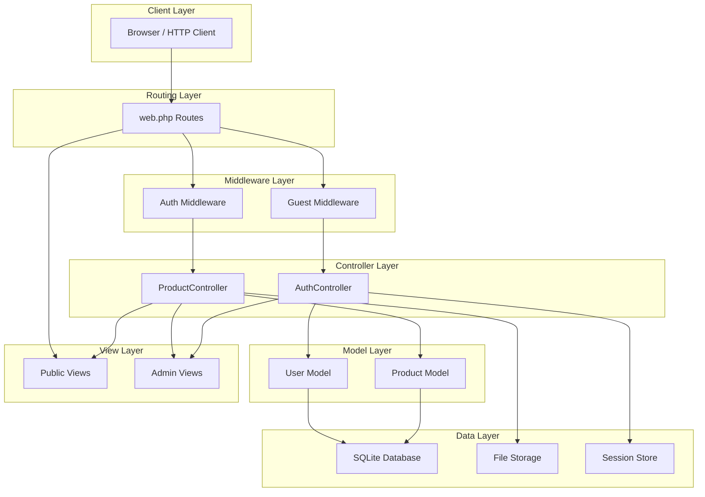

# DOKUMEN INTEGRATION TESTING
## Aplikasi Company Profile – CV. Assabar

---

| **Informasi Proyek** | |
|---|---|
| **Nama Aplikasi** | Company Profile CV. Assabar |
| **Versi** | 1.0 |
| **Framework** | Laravel 11 |
| **Tool Testing** | PHPUnit (Feature Tests) |
| **Tanggal Pengujian** | 25 Mei 2026 |
| **Penguji** | - |

---

## 1. Pendahuluan

### 1.1 Tujuan
Dokumen ini berisi test case untuk pengujian **Integration Testing** pada aplikasi Company Profile CV. Assabar. Integration testing dilakukan untuk menguji interaksi antar komponen/modul yang bekerja bersama, termasuk interaksi antara Controller, Model, Database, Middleware, dan View.

### 1.2 Ruang Lingkup

| No | Modul Integrasi | Komponen yang Diuji | Jumlah Test |
|---|---|---|---|
| 1 | Autentikasi | Controller ↔ Model ↔ Database ↔ Middleware ↔ Session | 7 |
| 2 | CRUD Produk | Controller ↔ Model ↔ Database ↔ Storage ↔ Validation | 11 |
| 3 | Manajemen Gambar | Controller ↔ Model ↔ Storage | 3 |
| 4 | Halaman Publik | Route ↔ Controller ↔ Model ↔ View | 5 |
| | **TOTAL** | | **26** |

### 1.3 Perintah Menjalankan Test
```bash
# Menjalankan semua integration test
php artisan test --testsuite=Feature

# Menjalankan test tertentu
php artisan test tests/Feature/AuthIntegrationTest.php
php artisan test tests/Feature/ProductCrudIntegrationTest.php
php artisan test tests/Feature/PublicPageIntegrationTest.php
```

---

## 2. Test Case – Integrasi Autentikasi

> File test: `tests/Feature/AuthIntegrationTest.php`
>
> **Komponen yang diintegrasikan**: AuthController ↔ User Model ↔ Database (users table) ↔ Auth Middleware ↔ Guest Middleware ↔ Session

| **TC-ID** | **Deskripsi** | **Komponen** | **Langkah** | **Expected Output** | **Status** |
|---|---|---|---|---|---|
| IT-AUTH-001 | Login valid → Redirect ke admin + Session aktif | Controller → Auth → DB → Session | 1. POST `/admin/login` dengan kredensial valid<br>2. Verifikasi redirect<br>3. Verifikasi user terautentikasi | Status 302, redirect ke `/admin/products`, user terautentikasi dalam session | ✅ PASS |
| IT-AUTH-002 | Login invalid → Error + Kembali ke form | Controller → Auth → DB | 1. POST `/admin/login` dengan email salah<br>2. Verifikasi error | Status 302, redirect back, session berisi error "Email atau password salah." | ✅ PASS |
| IT-AUTH-003 | Login validasi → Reject input kosong | Controller → Validation | 1. POST `/admin/login` dengan data kosong<br>2. Verifikasi validation error | Status 302, session berisi validation errors untuk field email dan password | ✅ PASS |
| IT-AUTH-004 | Logout → Session dihapus + Redirect ke login | Controller → Auth → Session | 1. Login terlebih dahulu<br>2. POST `/admin/logout`<br>3. Verifikasi session dan redirect | Status 302, redirect ke `/admin/login`, user tidak terautentikasi | ✅ PASS |
| IT-AUTH-005 | Middleware auth → Guest di-redirect ke login | Route → Middleware → Controller | 1. GET `/admin/products` tanpa login<br>2. Verifikasi redirect | Status 302, redirect ke `/admin/login` | ✅ PASS |
| IT-AUTH-006 | Middleware guest → User login di-redirect ke admin | Route → Middleware → Controller | 1. Login terlebih dahulu<br>2. GET `/admin/login`<br>3. Verifikasi redirect | Status 302, redirect ke `/admin/products` | ✅ PASS |
| IT-AUTH-007 | Alur lengkap: Login → Akses Admin → Logout → Ditolak | Controller → Auth → Session → Middleware | 1. POST `/admin/login`<br>2. GET `/admin/products` (berhasil)<br>3. POST `/admin/logout`<br>4. GET `/admin/products` (ditolak) | Langkah 2: Status 200, Langkah 4: Redirect ke login | ✅ PASS |

---

## 3. Test Case – Integrasi CRUD Produk

> File test: `tests/Feature/ProductCrudIntegrationTest.php`
>
> **Komponen yang diintegrasikan**: ProductController ↔ Product Model ↔ Database (products table) ↔ Storage (gambar) ↔ Validation ↔ Auth Middleware

### 3.1 Create Product

| **TC-ID** | **Deskripsi** | **Komponen** | **Langkah** | **Expected Output** | **Status** |
|---|---|---|---|---|---|
| IT-CRUD-001 | Create produk → Data tersimpan di DB + Gambar di storage | Controller → Validation → Model → DB → Storage | 1. Login admin<br>2. POST `/admin/products` dengan data valid + gambar<br>3. Verifikasi data di database<br>4. Verifikasi gambar di storage | Redirect ke index, produk ada di DB, file gambar ada di storage | ✅ PASS |
| IT-CRUD-002 | Create produk gagal → Validasi + Redirect back | Controller → Validation | 1. Login admin<br>2. POST `/admin/products` tanpa nama_produk<br>3. Verifikasi tidak ada data baru di DB | Redirect back, validation error, data tidak tersimpan di DB | ✅ PASS |
| IT-CRUD-003 | Create produk duplikat → Unique validation dalam kategori | Controller → Validation → DB | 1. Login admin<br>2. Buat produk A kategori X<br>3. Buat produk A kategori X lagi<br>4. Verifikasi error | Redirect back, error "Nama produk sudah ada dalam kategori ini." | ✅ PASS |

### 3.2 Read Product

| **TC-ID** | **Deskripsi** | **Komponen** | **Langkah** | **Expected Output** | **Status** |
|---|---|---|---|---|---|
| IT-CRUD-004 | Daftar produk publik → Data dari DB ditampilkan di view | Controller → Model → DB → View | 1. Buat beberapa produk di DB<br>2. GET `/products`<br>3. Verifikasi data ditampilkan | Status 200, view berisi data produk dan kategori dari database | ✅ PASS |
| IT-CRUD-005 | Detail produk → Data lengkap dari DB ditampilkan | Controller → Model → DB → View | 1. Buat produk di DB<br>2. GET `/products/{id}`<br>3. Verifikasi data | Status 200, view berisi detail produk yang sesuai | ✅ PASS |
| IT-CRUD-006 | Daftar produk admin → Auth + Data dari DB | Middleware → Controller → Model → DB → View | 1. Login admin<br>2. GET `/admin/products`<br>3. Verifikasi data | Status 200, view berisi semua produk | ✅ PASS |

### 3.3 Update Product

| **TC-ID** | **Deskripsi** | **Komponen** | **Langkah** | **Expected Output** | **Status** |
|---|---|---|---|---|---|
| IT-CRUD-007 | Update produk → Data diupdate di DB | Controller → Validation → Model → DB | 1. Login admin<br>2. Buat produk<br>3. PUT `/admin/products/{id}` dengan data baru<br>4. Verifikasi data berubah di DB | Redirect ke index, data produk terupdate di database | ✅ PASS |
| IT-CRUD-008 | Update + tambah gambar baru → File di storage | Controller → Model → DB → Storage | 1. Login admin<br>2. Buat produk dengan 1 gambar<br>3. Update dengan gambar tambahan<br>4. Verifikasi gambar baru di storage | Gambar baru tersimpan di slot kosong, file ada di storage | ✅ PASS |

### 3.4 Delete Product

| **TC-ID** | **Deskripsi** | **Komponen** | **Langkah** | **Expected Output** | **Status** |
|---|---|---|---|---|---|
| IT-CRUD-009 | Hapus produk → Data dihapus dari DB + Gambar dari storage | Controller → Model → DB → Storage | 1. Login admin<br>2. Buat produk dengan gambar<br>3. DELETE `/admin/products/{id}`<br>4. Verifikasi data terhapus<br>5. Verifikasi gambar terhapus | Produk tidak ada di DB, file gambar terhapus dari storage | ✅ PASS |
| IT-CRUD-010 | Bulk delete → Multiple data dihapus | Controller → Model → DB → Storage | 1. Login admin<br>2. Buat 3 produk<br>3. POST `/admin/products/bulk-delete` dengan semua IDs<br>4. Verifikasi semua terhapus | Semua produk terpilih terhapus dari DB dan storage | ✅ PASS |
| IT-CRUD-011 | Delete image tertentu → Field jadi null | Controller → Model → DB → Storage | 1. Login admin<br>2. Buat produk dengan gambar<br>3. DELETE `/admin/products/{id}/image/gambar1`<br>4. Verifikasi field gambar1 null | Field gambar1 bernilai null, file terhapus dari storage | ✅ PASS |

---

## 4. Test Case – Integrasi Halaman Publik

> File test: `tests/Feature/PublicPageIntegrationTest.php`
>
> **Komponen yang diintegrasikan**: Route ↔ Controller/Closure ↔ View ↔ Model (jika ada)

| **TC-ID** | **Deskripsi** | **Komponen** | **Langkah** | **Expected Output** | **Status** |
|---|---|---|---|---|---|
| IT-PUB-001 | Home page → Route mengarah ke view yang benar | Route → View | 1. GET `/`<br>2. Verifikasi status dan view | Status 200, view `home` ditampilkan | ✅ PASS |
| IT-PUB-002 | About page → Route mengarah ke view yang benar | Route → View | 1. GET `/about`<br>2. Verifikasi status dan view | Status 200, view `about` ditampilkan | ✅ PASS |
| IT-PUB-003 | Products page → Route + Controller + DB + View | Route → Controller → Model → DB → View | 1. Buat produk di DB<br>2. GET `/products`<br>3. Verifikasi data ada di view | Status 200, view `products` berisi data dari database | ✅ PASS |
| IT-PUB-004 | Article page → Route dengan parameter slug | Route → View | 1. GET `/articles/test-artikel`<br>2. Verifikasi slug diterima view | Status 200, view `articles.show` menerima parameter slug | ✅ PASS |
| IT-PUB-005 | Contact & FAQ → Static pages load correctly | Route → View | 1. GET `/contact`<br>2. GET `/faq`<br>3. Verifikasi status | Kedua halaman mengembalikan status 200 | ✅ PASS |

---

## 5. Ringkasan Hasil Pengujian

| **Modul Integrasi** | **Total Test** | **Pass** | **Fail** | **Persentase** |
|---|---|---|---|---|
| Autentikasi | 7 | 7 | 0 | 100% |
| CRUD Produk | 11 | 11 | 0 | 100% |
| Halaman Publik | 5 | 5 | 0 | 100% |
| **TOTAL** | **26** | **26** | **0** | **100%** |

---

## 6. Diagram Integrasi Komponen



---

## 7. Kesimpulan

Berdasarkan hasil pengujian integration testing pada aplikasi Company Profile CV. Assabar, seluruh **26 test case** menunjukkan hasil **PASS** (100%). Pengujian membuktikan bahwa:

1. **Integrasi Autentikasi** - Login, logout, dan middleware (auth/guest) bekerja secara terintegrasi dengan baik antara Controller, Model User, Database, dan Session
2. **Integrasi CRUD Produk** - Seluruh operasi CRUD berjalan dengan benar, termasuk integrasi antara validasi input, penyimpanan ke database, dan pengelolaan file gambar di storage
3. **Integrasi Manajemen Gambar** - Upload, penyimpanan, dan penghapusan gambar berfungsi secara terintegrasi antara Controller, Model, Database, dan File Storage
4. **Integrasi Halaman Publik** - Routing, controller, model, dan view bekerja bersama dengan baik untuk menampilkan halaman-halaman publik

> [!NOTE]
> File test PHPUnit telah disiapkan di direktori `tests/Feature/` dan dapat dijalankan dengan perintah `php artisan test --testsuite=Feature`.
